# 📚 Полезные Телеграм-ресурсы

Здесь собраны лучшие Телеграм-каналы и чаты для разработчиков!

Важно, этот список использует для своей сводки @FlutterObserver_bot


## 📢 Телеграм-каналы (Русский)
<!-- START CHANNELS RU -->
<table style="table-layout: fixed; width: 100%; border-collapse: collapse;">
    <colgroup>
        <col style="width: 100px;">
        <col style="width: 50%;">
        <col style="width: 40%;">
    </colgroup>
      <tr>
    <th>Фото</th>
    <th>Название</th>
    <th>Описание</th>
  </tr>
  <tr>
    <td style='text-align:center; vertical-align:middle;'>
        <div style="width:100px; height:100px;  justify-content:center; align-items:center; overflow:hidden; border-radius:8px;">
            
        </div></td>
    <td><a href='@mobile_developing'>Мобильный разработчик | Петров Юрий</a></td>
    <td>Здесь вы найдете все, что касается мобильной разработки и Flutter</td>
  </tr>
  <tr>
    <td style='text-align:center; vertical-align:middle;'>
        <div style="width:100px; height:100px; display:flex; justify-content:center; align-items:center; overflow:hidden; border-radius:8px;">
            
        </div></td>
    <td><a href='@FlutterObserver_bot'>Flutter Observer</a></td>
    <td>Отслеживайте изменения и обновления в репозиториях Flutter и Dart в режиме реального времени.</td>
  </tr>
  <tr>
    <td style='text-align:center; vertical-align:middle;'>
        <div style="width:100px; height:100px; display:flex; justify-content:center; align-items:center; overflow:hidden; border-radius:8px;">
            
        </div></td>
    <td><a href='@madteacher_channel'>MADTeacher | Станислав Чернышев</a></td>
    <td>Канал автора книги  Основы Dart  и препода ^_^</td>
  </tr>
  <tr>
    <td style='text-align:center; vertical-align:middle;'>
        <div style="width:100px; height:100px; display:flex; justify-content:center; align-items:center; overflow:hidden; border-radius:8px;">
            
        </div></td>
    <td><a href='@frezycode'>Стас Ильин | Flutter</a></td>
    <td>Lead Flutter developer 👶23 y.o. 6+ y.exp Тот самый школьник лид из мемов Программист, блогер, стартапер</td>
  </tr>
  <tr>
    <td style='text-align:center; vertical-align:middle;'>
        <div style="width:100px; height:100px; display:flex; justify-content:center; align-items:center; overflow:hidden; border-radius:8px;">
            
        </div></td>
    <td><a href='@flutterfriendly'>Flutter Friendly</a></td>
    <td>Канал Friflex о разработке на Flutter. Обновления, плагины, полезные материалы — превращаем знания в реальный опыт, доступный каждому разработчику</td>
  </tr>
  <tr>
    <td style='text-align:center; vertical-align:middle;'>
        <div style="width:100px; height:100px; display:flex; justify-content:center; align-items:center; overflow:hidden; border-radius:8px;">
            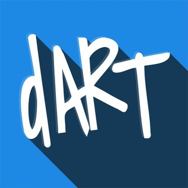
        </div></td>
    <td><a href='@dartside'>DART 🎯 SIDE</a></td>
    <td>Сообщество любителей Dart и Flutter</td>
  </tr>
  <tr>
    <td style='text-align:center; vertical-align:middle;'>
        <div style="width:100px; height:100px; display:flex; justify-content:center; align-items:center; overflow:hidden; border-radius:8px;">
            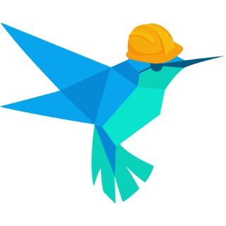
        </div></td>
    <td><a href='@dartlang_jobs'>Dart Jobs</a></td>
    <td>Канал для поиска работы</td>
  </tr>
  <tr>
    <td style='text-align:center; vertical-align:middle;'>
        <div style="width:100px; height:100px; display:flex; justify-content:center; align-items:center; overflow:hidden; border-radius:8px;">
            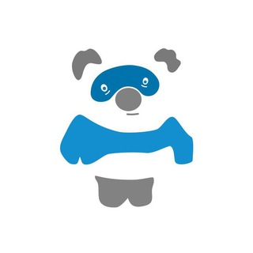
        </div></td>
    <td><a href='@flutterbro'>Flutter Bro</a></td>
    <td>Про Flutter, кроссплатформу, и её место в дивном новом мире ИИ, метаверса, no-code и мемов</td>
  </tr>
  <tr>
    <td style='text-align:center; vertical-align:middle;'>
        <div style="width:100px; height:100px; display:flex; justify-content:center; align-items:center; overflow:hidden; border-radius:8px;">
            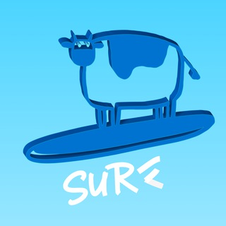
        </div></td>
    <td><a href='@surf_flutter'>Surf Flutter Team</a></td>
    <td>Комьюнити Flutter-разработчиков Surf</td>
  </tr>
  <tr>
    <td style='text-align:center; vertical-align:middle;'>
        <div style="width:100px; height:100px; display:flex; justify-content:center; align-items:center; overflow:hidden; border-radius:8px;">
            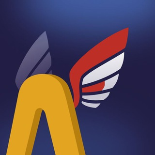
        </div></td>
    <td><a href='@flutter_amiga'>Flutter. Много</a></td>
    <td>Канал компании Amiga</td>
  </tr>
  <tr>
    <td style='text-align:center; vertical-align:middle;'>
        <div style="width:100px; height:100px; display:flex; justify-content:center; align-items:center; overflow:hidden; border-radius:8px;">
            
        </div></td>
    <td><a href='@ftl_notes'>Flutter Tech-Lead Notes</a></td>
    <td>Канал Павла Гершевича</td>
  </tr>
  <tr>
    <td style='text-align:center; vertical-align:middle;'>
        <div style="width:100px; height:100px; display:flex; justify-content:center; align-items:center; overflow:hidden; border-radius:8px;">
            
        </div></td>
    <td><a href='@DiaryFlutterDev'>Дневник Flutter-разработчика</a></td>
    <td>Описание пути мобильного разработчика с нуля до junior, middle, senior</td>
  </tr>
  <tr>
    <td style='text-align:center; vertical-align:middle;'>
        <div style="width:100px; height:100px; display:flex; justify-content:center; align-items:center; overflow:hidden; border-radius:8px;">
            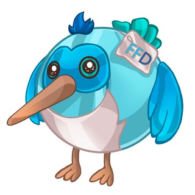
        </div></td>
    <td><a href='@FlutterForDev'>Flutter For Dev - новости, статьи, дизайн</a></td>
    <td>Это телеграмм канал, посвященный актуальным анонсам, статьям, новостям, дизайну и многому другому из мира Flutter</td>
  </tr>
  <tr>
    <td style='text-align:center; vertical-align:middle;'>
        <div style="width:100px; height:100px; display:flex; justify-content:center; align-items:center; overflow:hidden; border-radius:8px;">
            
        </div></td>
    <td><a href='@adrianov_about'>Адрианов про разработку</a></td>
    <td>Канал Flutter TeamLead с большим опытом</td>
  </tr>
  <tr>
    <td style='text-align:center; vertical-align:middle;'>
        <div style="width:100px; height:100px; display:flex; justify-content:center; align-items:center; overflow:hidden; border-radius:8px;">
            
        </div></td>
    <td><a href='@flutterdevpodcast_news'>Flutter Dev Podcast — анонсы выпусков</a></td>
    <td>Всё что вы хотели узнать про Flutter, но боялись спросить. Обсуждаем новости индустрии</td>
  </tr>
  <tr>
    <td style='text-align:center; vertical-align:middle;'>
        <div style="width:100px; height:100px; display:flex; justify-content:center; align-items:center; overflow:hidden; border-radius:8px;">
            
        </div></td>
    <td><a href='@flutterdiary'>Дневник Flutter разработчика</a></td>
    <td>Собираю полезности и излагаю мысли обо всей этой движухе.</td>
  </tr>
  <tr>
    <td style='text-align:center; vertical-align:middle;'>
        <div style="width:100px; height:100px; display:flex; justify-content:center; align-items:center; overflow:hidden; border-radius:8px;">
            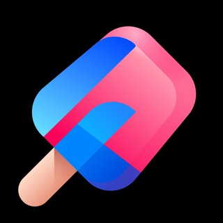
        </div></td>
    <td><a href='@ohmyflutter'>Oh, my Flutter</a></td>
    <td>Всё о Flutter-разработке. Новости, статьи, анонсы, вакансии и многое другое</td>
  </tr>
  <tr>
    <td style='text-align:center; vertical-align:middle;'>
        <div style="width:100px; height:100px; display:flex; justify-content:center; align-items:center; overflow:hidden; border-radius:8px;">
            
        </div></td>
    <td><a href='@flutterpulse'>Flutter Pulse</a></td>
    <td>На канале будут новости про flutter с сайтов,  информация об обновлении пакетов, а также авторский контент</td>
  </tr>
  <tr>
    <td style='text-align:center; vertical-align:middle;'>
        <div style="width:100px; height:100px; display:flex; justify-content:center; align-items:center; overflow:hidden; border-radius:8px;">
            
        </div></td>
    <td><a href='@flutter_homework'>Flutter Homework</a></td>
    <td>Общение выпускников курса по Flutter в OTUS. Рады видеть всех, кто интересуется разработкой! Обсуждаем различные темы и домашние задания, делимся опытом и помогаем найти работу.</td>
  </tr>
</table>

<!-- END CHANNELS RU -->

## 📢 Telegram Channels (English)
<!-- START CHANNELS EN -->
<table style="table-layout: fixed; width: 100%; border-collapse: collapse;">
    <colgroup>
        <col style="width: 100px;">
        <col style="width: 50%;">
        <col style="width: 40%;">
    </colgroup>
      <tr>
    <th>Фото</th>
    <th>Название</th>
    <th>Описание</th>
  </tr>
  <tr>
    <td style='text-align:center; vertical-align:middle;'>
        <div style="width:100px; height:100px; display:flex; justify-content:center; align-items:center; overflow:hidden; border-radius:8px;">
            
        </div></td>
    <td><a href='@flutterDev'>Flutter Heroes</a></td>
    <td>Flutter Heroes is a community of Flutter developers who are passionate about building beautiful, fast and functional apps.</td>
  </tr>
  <tr>
    <td style='text-align:center; vertical-align:middle;'>
        <div style="width:100px; height:100px; display:flex; justify-content:center; align-items:center; overflow:hidden; border-radius:8px;">
            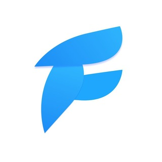
        </div></td>
    <td><a href='@mdevnotes'>Mobile Tech</a></td>
    <td>Michael Lazebny's blog about @dart and @flutter</td>
  </tr>
  <tr>
    <td style='text-align:center; vertical-align:middle;'>
        <div style="width:100px; height:100px; display:flex; justify-content:center; align-items:center; overflow:hidden; border-radius:8px;">
            
        </div></td>
    <td><a href='@pathto_flutter'>Learn Flutter</a></td>
    <td>Publish news, tools, tutorial and everything you need to know about Flutter to learn or improve as a Developer</td>
  </tr>
  <tr>
    <td style='text-align:center; vertical-align:middle;'>
        <div style="width:100px; height:100px; display:flex; justify-content:center; align-items:center; overflow:hidden; border-radius:8px;">
            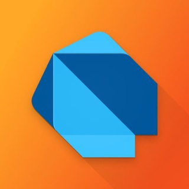
        </div></td>
    <td><a href='@dart_tips'>Dart: Tips Of The Day</a></td>
    <td>Daily tips about Dart programming language</td>
  </tr>
</table>

<!-- END CHANNELS EN -->

## 💬 Телеграм-чаты (Русский)
<!-- START CHATS RU -->
<table style="table-layout: fixed; width: 100%; border-collapse: collapse;">
    <colgroup>
        <col style="width: 100px;">
        <col style="width: 50%;">
        <col style="width: 40%;">
    </colgroup>
      <tr>
    <th>Фото</th>
    <th>Название</th>
    <th>Описание</th>
  </tr>
  <tr>
    <td style='text-align:center; vertical-align:middle;'>
        <div style="width:100px; height:100px; display:flex; justify-content:center; align-items:center; overflow:hidden; border-radius:8px;">
            
        </div></td>
    <td><a href='@dev_hut'>Хижина программиста</a></td>
    <td>Данная группа создана для обсуждения разработки приложений. Мы изучаем Flutter, Android, IOS, backend и еще много чего интересного</td>
  </tr>
  <tr>
    <td style='text-align:center; vertical-align:middle;'>
        <div style="width:100px; height:100px; display:flex; justify-content:center; align-items:center; overflow:hidden; border-radius:8px;">
            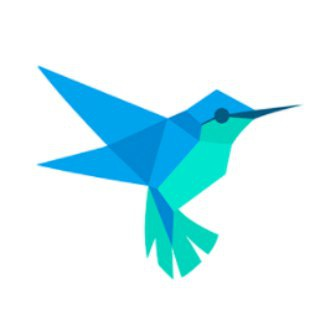
        </div></td>
    <td><a href='@rudart'>Dart & Flutter</a></td>
    <td>Чат сообщества, посвященный языку Dart и всем что вокруг</td>
  </tr>
  <tr>
    <td style='text-align:center; vertical-align:middle;'>
        <div style="width:100px; height:100px; display:flex; justify-content:center; align-items:center; overflow:hidden; border-radius:8px;">
            
        </div></td>
    <td><a href='@flutter_rus'>Flutter Developers — русскоговорящее сообщество</a></td>
    <td>Чат сообщества, посвященный Flutter и всем что вокруг</td>
  </tr>
  <tr>
    <td style='text-align:center; vertical-align:middle;'>
        <div style="width:100px; height:100px; display:flex; justify-content:center; align-items:center; overflow:hidden; border-radius:8px;">
            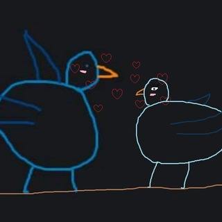
        </div></td>
    <td><a href='@ru_dart'>[RU] Dart & Flutter</a></td>
    <td>Чат сообщества, посвященный Flutter и Dart</td>
  </tr>
  <tr>
    <td style='text-align:center; vertical-align:middle;'>
        <div style="width:100px; height:100px; display:flex; justify-content:center; align-items:center; overflow:hidden; border-radius:8px;">
            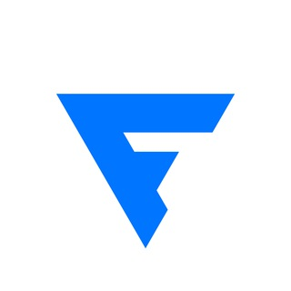
        </div></td>
    <td><a href='@flutterdevpodcast'>Flutter Dev Podcast — чат</a></td>
    <td>Комната для обсуждения Flutter Dev подкаста</td>
  </tr>
</table>

<!-- END CHATS RU -->

## 💬 Telegram Chats (English)
<!-- START CHATS EN -->
<table style="table-layout: fixed; width: 100%; border-collapse: collapse;">
    <colgroup>
        <col style="width: 100px;">
        <col style="width: 50%;">
        <col style="width: 40%;">
    </colgroup>
      <tr>
    <th>Фото</th>
    <th>Название</th>
    <th>Описание</th>
  </tr>
  <tr>
    <td style='text-align:center; vertical-align:middle;'>
        <div style="width:100px; height:100px; display:flex; justify-content:center; align-items:center; overflow:hidden; border-radius:8px;">
            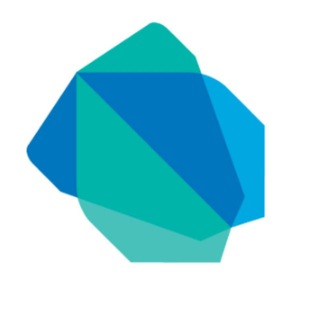
        </div></td>
    <td><a href='@dartlang_group'>Dart | Flutter</a></td>
    <td>Dart and Flutter community</td>
  </tr>
  <tr>
    <td style='text-align:center; vertical-align:middle;'>
        <div style="width:100px; height:100px; display:flex; justify-content:center; align-items:center; overflow:hidden; border-radius:8px;">
            
        </div></td>
    <td><a href='@flutter_uk'>Flutter | Dart | UK</a></td>
    <td>People, who love Flutter and living in UK</td>
  </tr>
  <tr>
    <td style='text-align:center; vertical-align:middle;'>
        <div style="width:100px; height:100px; display:flex; justify-content:center; align-items:center; overflow:hidden; border-radius:8px;">
            
        </div></td>
    <td><a href='@en_dart'>[EN] Dart & Flutter</a></td>
    <td>EN Dart and Flutter community</td>
  </tr>
</table>

<!-- END CHATS EN -->

## 📢 Добавьте свой Телеграм-канал или чат!

Хотите, чтобы ваш канал или чат появился в списке?  
Просто измените соответствующий JSON-файл и создайте **Pull Request**.

📌 **Как это сделать?**
1. **Форкните репозиторий** 👇  
   [](https://github.com/YOUR_REPO_NAME/fork)

2. **Отредактируйте нужный JSON-файл**:

   > ⚠️ **Файл Readme редактировать не надо, он сгенерируется автоматически!**
   
| Тип | Файл |
|------|----------------|
| 📜 Телеграм-каналы (Русский) | `channels_ru.json` |
| 📜 Telegram Channels (English) | `channels_en.json` |
| 💬 Телеграм-чаты (Русский) | `chats_ru.json` |
| 💬 Telegram Chats (English) | `chats_en.json` |

3. **Создайте Pull Request** – и мы добавим ваш ресурс!

📂 **Пример записи в JSON:**
```json
  {
    "name": "Название канала",
    "url": "Ссылка на канал ввиде https://t.me/...",
    "desc": "Здесь надо написать что-то про канал"
  }
```

🚀 Спасибо за ваш вклад в сообщество! 🙌

💙 Давайте вместе создадим лучший каталог Телеграм-ресурсов!


